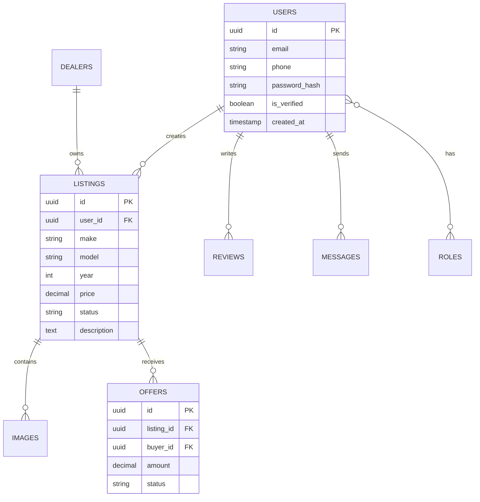

# 🚗 EthioDrive Premium Car Marketplace

<div align="center">
  <h3>The Most Trusted and Premium Digital Automotive Marketplace in Ethiopia</h3>
</div>

---

## Table of Contents

1. [Project Vision](#1-project-vision)
2. [Supported Platforms](#2-supported-platforms)
3. [UI/UX Design System](#3-uiux-design-system)
4. [Complete Feature Specification](#4-complete-feature-specification)
5. [Technical Architecture](#5-technical-architecture)
6. [Backend Architecture](#6-backend-architecture)
7. [Database Design](#7-database-design)
8. [Firebase Integration](#8-firebase-integration)
9. [Security](#9-security)
10. [AI Features](#10-ai-features)
11. [Revenue Model](#11-revenue-model)
12. [Admin Dashboard](#12-admin-dashboard)
13. [API Documentation](#13-api-documentation)
14. [Scalability](#14-scalability)
15. [Deployment](#15-deployment)
16. [Release Management](#16-release-management)
17. [Development Roadmap](#17-development-roadmap)
18. [Coding Standards](#18-coding-standards)

---

## 1. Project Vision

### Vision
To become the premier, most trusted digital automotive marketplace in Ethiopia, redefining how vehicles are bought, sold, and evaluated.

### Mission
Connecting buyers, sellers, and dealers through a secure, transparent, and luxurious digital experience backed by AI and rigorous verification processes.

### Goals
- Eliminate fraud and scams in the Ethiopian car market.
- Streamline vehicle transactions with digital tools.
- Provide accurate, AI-powered vehicle valuations.
- Deliver a premium, seamless user experience across all devices.

### Problem Statement
The Ethiopian car market currently suffers from a lack of transparency, fragmented information, inconsistent pricing, and a high prevalence of fraudulent listings. Buyers struggle to verify vehicle history and condition, while genuine sellers compete with scammers.

### Market Opportunity
Ethiopia boasts a rapidly growing middle class, increasing internet and smartphone penetration, and a consistently high demand for both new and used vehicles. A centralized, premium platform will capture this untapped digital market.

### Business Model
A multi-sided platform generating revenue through dealer subscriptions, premium listing placements, integrated advertising, and strategic partnerships for vehicle inspections and financing.

---

## 2. Supported Platforms

The application is built to provide a seamless experience across a comprehensive range of devices and operating systems.

- 📱 **Mobile Apps**: Native-like performance on Android and iOS.
- 💻 **Desktop Apps**: Dedicated applications for Windows, macOS, and Linux.
- 🌐 **Web Version**: Fully responsive design with Progressive Web App (PWA) capabilities for browser-based access.
- 📟 **Tablet Version**: Optimized layouts for Android Tablets and iPads, fully supporting both Landscape and Portrait orientations.
- 🖥 **Admin Dashboard**: A robust, web-based dashboard optimized for desktop browsers, with responsive support for tablet management on the go.

---

## 3. UI/UX Design System

The platform utilizes a **Premium Luxury Design Language** to instill trust and exclusivity.

- **Theme**: Obsidian Dark Theme (`#0B0C10`) for a modern, sleek appearance.
- **Accents**: Gold Accent System (`#D4AF37`) to highlight primary actions and premium features.
- **Typography**: Clean, modern sans-serif fonts (e.g., *Inter* or *Outfit*) for readability and elegance.
- **Spacing**: Generous whitespace (8pt grid system) to allow content to breathe.
- **Iconography**: Custom, minimalist line icons.
- **Components**:
  - **Buttons**: Pill-shaped with subtle gradients and drop shadows.
  - **Cards**: Glassmorphism effects with slight transparency and blur over dark backgrounds.
  - **Navigation**: 
    - Floating Bottom Navigation for mobile.
    - Responsive App Bar with contextual actions.
- **Search Experience**: Prominent, predictive, and filter-rich search bar accessible from the home screen.
- **Animations**: Fluid micro-interactions (60fps), Hero transitions for vehicle images, and subtle loading skeletons.
- **Accessibility**: High contrast ratios, screen reader support, and scalable text sizes.
- **Responsive Design**: Fluid layouts that adapt gracefully from mobile screens to ultrawide desktop monitors.

---

## 4. Complete Feature Specification

### Core Features
- **Authentication**: Biometric login, SMS OTP (Ethio Telecom/Safaricom), Email/Password, OAuth (Google/Apple).
- **Buyer Features**: Saved searches, price drop alerts, direct messaging, schedule test drives, financing calculators.
- **Seller Features**: Step-by-step listing wizard, document upload, performance analytics.
- **Dealer Features**: Bulk inventory upload, branded dealer pages, lead management CRM, staff accounts.
- **Admin Features**: Global dashboard, user moderation, dispute resolution, platform analytics.

### Advanced Capabilities
- **AI Assistant & Smart Search**: Natural language search (e.g., "Silver Toyota Vitz under 2 million ETB").
- **Vehicle Comparison**: Side-by-side spec, feature, and price comparison tool.
- **Favorites & Notifications**: Wishlists and real-time push/in-app notifications.
- **Chat & Offer System**: Secure, encrypted in-app messaging with a structured binding/non-binding offer system.
- **Reports, Reviews, & Ratings**: Peer reviews for dealers/sellers, detailed vehicle condition reports.

### Trust & Verification
- **Vehicle & Dealer Verification**: VIN lookup, physical inspection badges, KYC for dealers.
- **Fraud Prevention**: Automated scam detection algorithms, image metadata analysis, duplicate listing flags.
- **Vehicle History Support**: Integration with local authorities and service centers for accident/maintenance history.
- **Inspection Workflow**: Digital checklists for certified mechanics to upload inspection reports directly to listings.

### Media & Location
- **Image Gallery & Video Support**: High-res image grids, 360-degree interior views, video walkarounds.
- **Maps Integration & Location Services**: Google Maps API for dealer locations, proximity-based search (e.g., "Cars near Bole").

---

## 5. Technical Architecture

### Flutter Application Architecture
- **Framework**: Flutter (Dart) for true cross-platform compilation.
- **Architecture**: **Clean Architecture** (Presentation, Domain, Data layers) ensuring separation of concerns.
- **Structure**: **Feature-first folder structure** (e.g., `/features/auth/`, `/features/listings/`).
- **State Management**: BLoC / Riverpod for predictable and testable state management.
- **Design Patterns**: 
  - Repository Pattern for data abstraction.
  - Dependency Injection (via `get_it` and `injectable`).
- **Resilience**: 
  - Centralized Error Handling with custom exception classes.
  - Comprehensive Logging (using `logger` package).
  - Offline Support & Caching Strategy using Hive or Isar local databases.

---

## 6. Backend Architecture

- **Runtime & Framework**: Node.js utilizing NestJS or Express for a robust, highly structured, and scalable architecture.
- **Protocols**: REST API for standard CRUD operations; WebSocket (Socket.io) for real-time chat and notifications.
- **Security**: 
  - Authentication (JWT).
  - Authorization (Role-Based Access Control - RBAC).
  - Request Validation (class-validator, DTOs).
  - Rate Limiting (Redis-backed) to prevent abuse.
- **API Management**: Strict API versioning (e.g., `/api/v1/`) to ensure backward compatibility.

---

## 7. Database Design

- **Primary Database**: PostgreSQL (managed via Supabase).
- **Storage**: Supabase Storage Buckets for images, videos, and documents.

### ER Diagram



### Database Specifications
- **Table Descriptions**: Detailed metadata definitions for each table.
- **Relationships**: Strictly defined Foreign Keys with cascading deletes where appropriate.
- **Indexes**: B-Tree and GIN indexes on highly queried columns (e.g., make, model, price).
- **Constraints**: NOT NULL, UNIQUE, and CHECK constraints for data integrity.
- **Security**: Row Level Security (RLS) enforced at the database level to ensure users only access their own data.

---

## 8. Firebase Integration

- **Push Notifications**: Firebase Cloud Messaging (FCM) for targeted, real-time alerts.
- **Analytics**: Google Analytics for Firebase to track user journeys and feature engagement.
- **Crash Reporting**: Firebase Crashlytics for real-time crash tracking and debugging.
- **Performance Monitoring**: Firebase Performance Monitoring to track network requests and app rendering speeds.

---

## 9. Security

- **Authentication**: Stateless JWT with short-lived access tokens and secure, HttpOnly refresh tokens.
- **OAuth**: Secure integrations with Google and Apple authentication providers.
- **Secure Storage**: Flutter Secure Storage for client-side secrets and keychain management.
- **Encryption**: TLS 1.3 for data in transit; AES-256 for sensitive data at rest.
- **Anti-Fraud System & Scam Detection**: Machine learning models analyzing behavioral patterns, IP blacklisting, and anomaly detection.
- **Audit Logs**: Immutable audit trails for admin actions and critical user transactions.
- **Admin Moderation**: Dedicated tools to flag, shadow-ban, or remove suspicious accounts and listings.

---

## 10. AI Features

- **Vehicle Price Estimation**: Regression models predicting fair market value based on make, model, year, condition, and market trends.
- **Recommendation Engine**: Collaborative filtering suggesting vehicles based on user browsing history and saved searches.
- **Similar Vehicle Suggestions**: Content-based filtering to show alternatives on listing pages.
- **AI Search Assistant**: LLM-powered chatbot to help users find cars using conversational queries.
- **Fraud Detection Assistance**: Automated flagging of unrealistic prices, stolen images, or suspicious descriptions.

---

## 11. Revenue Model

- **Featured Listings**: Pay-per-day promotion for higher visibility in search results.
- **Dealer Subscriptions**: Monthly/Annual tiers providing CRM tools, bulk uploads, and analytics.
- **Advertisements**: Native, non-intrusive ad placements for automotive accessories and services.
- **Inspection Partnerships**: Commission on certified mechanical inspections booked through the app.
- **Financing Partnerships**: Lead generation fees from banks and micro-finance institutions for car loans.

---

## 12. Admin Dashboard

- **User Management**: View, ban, verify, and assist users.
- **Dealer Management**: Approve dealership applications, manage subscription statuses.
- **Vehicle Moderation**: Approve/reject listings, review flagged content.
- **Reports & Analytics**: High-level dashboards showing DAU/MAU, conversion rates, and total listing value.
- **Revenue**: Track subscriptions, ad revenue, and transaction fees.
- **Notifications**: System-wide announcements and targeted push notifications.
- **CMS**: Manage Terms of Service, Privacy Policy, and Help Center articles.

---

## 13. API Documentation

*Full documentation available via Swagger/OpenAPI at `/api/docs`.*

### Example: Get Vehicle Listings
**Endpoint**: `GET /api/v1/listings`

**Request Example**:
```http
GET /api/v1/listings?make=Toyota&sort=price_asc&limit=20
Authorization: Bearer <token>
```

**Response Example**:
```json
{
  "status": "success",
  "data": {
    "items": [
      {
        "id": "uuid-1234",
        "make": "Toyota",
        "model": "Corolla",
        "year": 2020,
        "price": 3500000,
        "currency": "ETB",
        "images": ["url1", "url2"]
      }
    ],
    "pagination": { "total": 150, "page": 1, "pages": 8 }
  }
}
```

**Error Responses**:
- `400 Bad Request`: Validation errors.
- `401 Unauthorized`: Missing or invalid JWT.
- `429 Too Many Requests`: Rate limit exceeded.

---

## 14. Scalability

Designed to support millions of concurrent users:
- **Load Balancing**: AWS ALB / Nginx distributing traffic across multiple Node.js instances.
- **Caching**: Redis for session data, highly queried static data, and API response caching.
- **Horizontal Scaling**: Stateless backend architecture allowing auto-scaling of containers based on CPU/Memory usage.
- **Disaster Recovery**: Multi-AZ database deployments with automated cross-region replication and point-in-time recovery.

---

## 15. Deployment & Infrastructure

- **CI/CD Pipeline**: GitHub Actions for automated linting, testing, and building.
- **Containerization**: Dockerized backend and frontend (web/admin) services.
- **Environments**: Strict separation of Development, Staging, and Production environments.
- **Platform Builds**:
  - **Android**: Automated Flutter build and deployment to Google Play Console.
  - **iOS**: Automated Flutter build and deployment to Apple App Store Connect via Fastlane.
  - **Web**: Flutter Web and Admin Dashboard deployed to highly available hosting (e.g., Vercel/Firebase Hosting).
- **Backend Deployment**: AWS ECS (Fargate) or Google Cloud Run.
- **Database Deployment**: Supabase Managed Cloud.
- **Networking**: Domain configuration with enforced SSL/TLS certificates.
- **CDN**: Cloudflare / AWS CloudFront for low-latency delivery of images and static assets.
- **File Storage**: Highly durable blob storage (AWS S3 / Supabase Storage).
- **Backups**: Automatic daily database snapshots with a robust retention policy.
- **Monitoring & Analytics**: Prometheus & Grafana for infrastructure monitoring; centralized logging, crash reporting, and performance analytics.

---

## 16. Release Management

- **Versioning Strategy**: Semantic Versioning (SemVer: `MAJOR.MINOR.PATCH`).
- **App Update Process**: Configurable in-app update prompts (Force update for critical API changes, flexible for minor features).
- **Database Migrations**: Automated schema migrations run during the CI/CD pipeline before code deployment.
- **Rollback Strategy**: Blue/Green deployments for zero-downtime releases and instant rollbacks in case of critical production failures.

---

## 17. Development Roadmap

### Phase 1: MVP (Months 1-3)
- User Authentication.
- Basic listing creation and search.
- Messaging system.
- Android and iOS applications.

### Phase 2: Premium Features (Months 4-6)
- Dealer accounts and dashboards.
- AI price estimation MVP.
- Web and Desktop builds.
- Payment gateway integration for featured listings.

### Phase 3: Scale & Trust (Months 7-9)
- Physical inspection badges.
- Advanced AI search and recommendations.
- Admin reporting and dispute resolution tools.

### Phase 4: Future Expansion (Months 10+)
- Financing integration.
- Spare parts marketplace.
- Regional expansion within East Africa.

---

## 18. Coding Standards

- **Naming Conventions**: 
  - `camelCase` for variables and functions.
  - `PascalCase` for classes and types.
  - `snake_case` for file names and database columns.
- **Folder Conventions**: Feature-based architecture enforced across frontend and backend.
- **Git Workflow**: GitFlow branching model (`main`, `develop`, `feature/*`, `hotfix/*`).
- **Commit Messages**: Conventional Commits standard (e.g., `feat(auth): add biometric login`).
- **Documentation**: 
  - Code comments required for complex logic.
  - JSDoc / DartDoc for all public methods.
  - Up-to-date README and API specifications.
